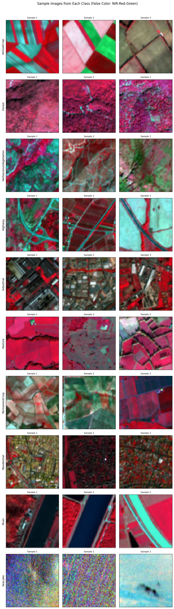
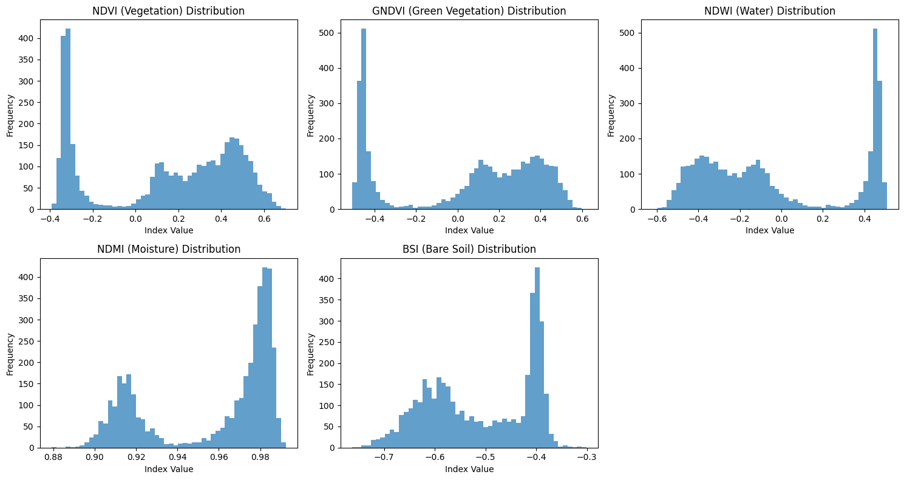

# EuroSAT Image Classification 


This project performs land use classification using the EuroSAT multispectral dataset. It combines advanced data augmentations, spectral index extraction, attention-based deep learning, semi-supervised learning, and ensemble methods to achieve robust classification.

## 📁 Dataset




The dataset used is the **EuroSAT Multispectral (12-bands)** dataset based on Sentinel-2 satellite imagery. 
The dataset was uploaded on kaggle and it was structured like this: 

```bash
EuroSAT_MS/
├── AnnualCrop/
├── Forest/
├── ...
├── testset/
│ ├── test_0000.npy
│ └── ...
```
including the **testset** provided. It can be changed from DATA_DIR and TEST_DIR variable path in the beginning of the 2 tracks. 




## 🛠 Dependencies

Install dependencies via:

```bash
pip install -r requirements.txt

```
The training was performed on Kaggle with 2 T4 GPUs using pytorch and cuda. 

# 🚀 Training
The full training and evaluation pipeline is initiated by running:

```bash
python main.py
```
for both tracks if converted in .py or by simply running the jupyter notebook of explained-track1.ipynb and explained-track2.ipynb. This will:

- Visualize dataset samples and bands.

- Train a 5-fold ensemble using an attention-augmented dual-branch CNN.

- Apply pseudo-labeling to test data and fine-tune the model in a semi-supervised loop.

- Visualize t-SNE embeddings and feature importance.

- Generate a CSV submission with Test-Time Augmentation (TTA).

# 🧪 Inference
As mentioned before, the inference is done by the main automatically, so it is not necessary to run it separately ( also included in the same jupyter notebook). After training or if pre-trained models are loaded:

- TTA and ensemble predictions are used on test .npy files.

- A CSV file named track1(or 2)_submission_improved.csv is saved to the working directory.


If you want to run the inference with the pretrained weights you just have to load them by inserting the path of the pretrained weights (ensemble_iter_2.pth) in the main: 

```python
    # 2) load or run semi-supervised loop
    ss_path = os.path.join('/kaggle/input/explained-track2', "ensemble_iter_2.pth")
    if os.path.isfile(ss_path):
        print("\nLoading pre-trained semi-supervised ensemble...")
        state_dicts = torch.load(ss_path)
        models = []
        for sd in state_dicts:
            m = ResNet50Classifier(num_classes=len(CLASSES), pretrained=True, freeze_backbone=False, input_channels=17).to(device)
            m.load_state_dict(sd)
            m.eval()
            models.append(m)
    else:
        print("\n2. Applying semi-supervised learning")
        models = semi_supervised_training(models, num_iterations=2)
```

and comment part 1). Then run the main that call the generate_submission function. 


# 📊 Output
We output then: 
- best_model_fold_X.pth: Best model checkpoints per fold.

- ensemble_iter_2.pth: Saved ensemble after semi-supervised learning.

- track1(or 2)_submission_improved.csv: Final submission.

#  Structure
### Track 1 - Custom Network
Key components, described in details in the presentation and in the code:

- EurosatDataset: Custom PyTorch Dataset with spectral index augmentation.

- ImprovedFusionClassifier: Dual-branch CNN with CBAM attention.

- train_kfold_models(): Cross-validation training routine.

- semi_supervised_training(): Iterative pseudo-labeling for SSL.

- generate_submission(): Final inference with ensemble + TTA.

### Track 2 – Pretrained ResNet-Based Model

Key components, described in details in the presentation and in the code:

- Preprocessing with Band Reordering and Normalization
The test set band order is realigned to match the expected input for pretrained models, and MinMax normalization is applied for consistency.

- EurosatDataset: As in Track 1.
- ResNet50 Backbone (TorchVision)
Loads a pretrained ResNet50 model from torchvision.models with ResNet50_Weights.IMAGENET1K_V2 and replaces the first and final layer.

- Data Augmentation Pipeline
Utilizes torchvision.transforms including RandomHorizontalFlip, RandomRotation, and ColorJitter to simulate common distortions in satellite images.

- Training Loop

- semi_supervised_training(): for fine tuning. 

- Test-Time Inference as above


## 👥 Authors

- **Erlisa Lokaj**  
  MCS  
  erlisa.lokaj@student.unisg.ch  

- **Lorenzo Sciarretta**  
  MCS  
  lorenzo.sciarretta@unisg.ch  

- **Zakaria Omarar**  
  MCS  
  zakaria.omarar@student.unisg.ch  

---
### _Disclaimer_ 
LLM as Chat-GPT 4 and Claude  were used to generate helping functions and debugging.